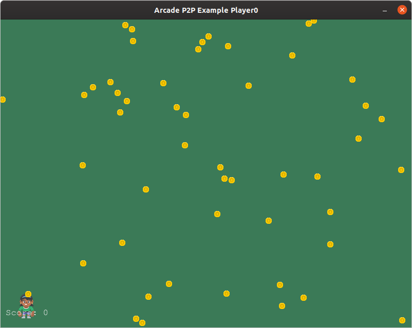

# p2p-arcade

## Create Peer To Peer Games With [Arcade](https://arcade.academy/) And [Python Banyan](https://mryslab.github.io/python_banyan/)

### Check Out The [Tutorial](https://mryslab.github.io/bots-in-pieces/python-banyan/arcade/2020/02/21/p2p-arcade-1.html)





This is a demonstration package illustrating the use of python_banyan in creating
a peer-to-peer game using arcade.

# Install
## Windows:
pip install p2p-arcade

## Linux/macOS
sudo pip3 install p2p-arcade

```
usage: p2p_arcade.py [-h] [-b BACK_PLANE_IP_ADDRESS] [-n PROCESS_NAME]
                     [-p PLAYER]

optional arguments:
  -h, --help            show this help message and exit
  -b BACK_PLANE_IP_ADDRESS
                        None or Common Backplane IP address
  -n PROCESS_NAME       Banyan Process Name Header Entry
  -p PLAYER             Select player 0 or 1
```

After installation,  to run the demo on a single computer, start player 0 (the coins) by opening a terminal and typing:
```bash
p2pa
```

Next open a second terminal and type:
```bash
p2pa -p 1
```

This will open player 1's window (the human sprite). Move the mouse into this window, click the left mouse button
to start the coins moving. Now click the right mouse button and start to collect the coins.

If you wish to run this as a distributed application, after opening up player 0's window, note the IP address being
used by the backplane.

```bash
************************************************************
Arcade p2p player0 using Back Plane IP address: 192.168.2.192
Subscriber Port = 43125
Publisher  Port = 43124
Loop Time = 0.0001 seconds
************************************************************

```

192.168.2.192 is the address that the backplane selected.

Now to start a second copy of p2pa on the second computer, specifying both
player 1 with the -p 1 option and the backplane address with the -b option.
Use the IP address noted when opening the first window:

```
p2pa -p 1 -b 192.168.2.192
```

This project was developed with
[Pycharm](https://www.jetbrains.com/pycharm/?from=p2p-arcade)


