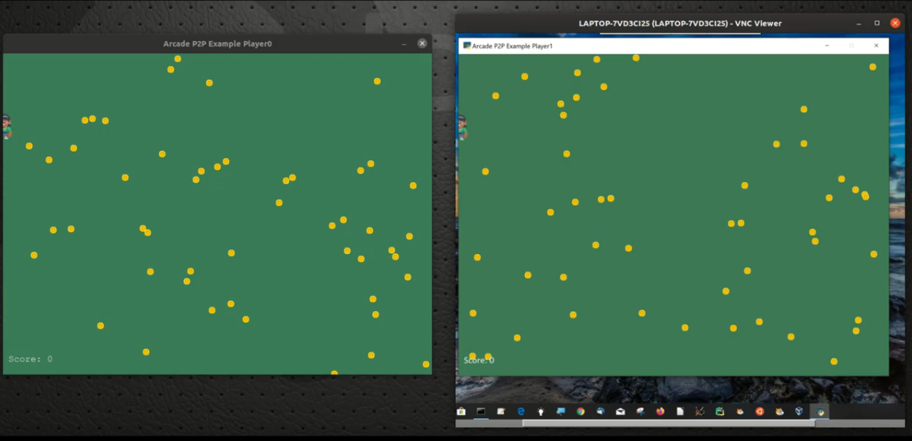

# p2p-arcade
## THIS IS A WORK IN PROGRESS 
## DOCUMENTATION IS NOT YET COMPLETE - WILL BE AVAILABLE SOON

## Beware - this is alpha level!



This is a demonstration package illustrating the use of python_banyan in creating
a peer-to-peer game using arcade.

# Install
## Windows:
pip install p2p-arcade

## Linux/macOS
sudo pip3 install p2p-arcade

```
usage: p2p_arcade.py [-h] [-b BACK_PLANE_IP_ADDRESS] [-n PROCESS_NAME]
                     [-p PLAYER]

optional arguments:
  -h, --help            show this help message and exit
  -b BACK_PLANE_IP_ADDRESS
                        None or Common Backplane IP address
  -n PROCESS_NAME       Banyan Process Name Header Entry
  -p PLAYER             Select player 0 or 1
```